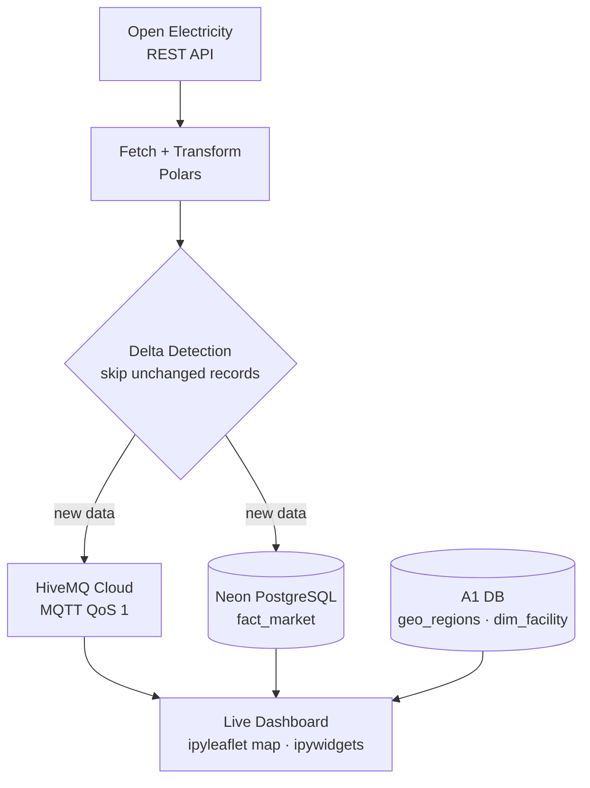

# Real-Time Energy Streaming Dashboard

A live streaming pipeline and interactive dashboard that pulls Australian NEM (National Electricity Market) data from a REST API, publishes it over MQTT, stores it in a cloud database, and visualises it on an interactive map — built as part of COMP5339 Data Engineering at the University of Sydney.

Solo project.

---

## What It Does

Every poll cycle, the pipeline fetches the latest power generation, emissions intensity, and market price/demand figures from the Open Electricity API. It applies delta-detection to skip unchanged records, publishes updates to an MQTT broker, and writes structured rows to PostgreSQL. A live dashboard renders facility locations on a map and updates widgets as new messages arrive.

---

## Pipeline



---

## Architecture

```
Open Electricity REST API
        │
        ▼
  Fetch + Transform        ← Polars (fast columnar processing)
        │
        ├──▶ Delta detection (skip unchanged records)
        │
        ├──▶ HiveMQ Cloud MQTT (QoS 1 publish)   ←── subscriber dashboard
        │
        └──▶ Neon PostgreSQL  (fact_market table)
                    │
                    └── enriched with facility geo data from energy-etl-pipeline DB
```

---

## Key Features

- **Delta-detection**: only publishes records where values have changed since the last poll — reduces unnecessary broker traffic
- **QoS 1 delivery**: at-least-once guarantee on MQTT messages
- **Polars** instead of pandas for data transformation — faster on NEM-scale tabular data
- **Geospatial enrichment**: joins live market data with the facility coordinates and region shapes from the [energy-etl-pipeline](../energy-etl-pipeline) database
- **Interactive dashboard**: `ipyleaflet` map showing facility locations + `ipywidgets` panels updating in real time

---

## Database Schema

```sql
CREATE TABLE fact_market (
    id              SERIAL PRIMARY KEY,
    facility_code   TEXT,
    interval_start  TIMESTAMPTZ,
    power_mw        NUMERIC,
    emissions_t     NUMERIC,
    market_price    NUMERIC,
    demand_mw       NUMERIC,
    inserted_at     TIMESTAMPTZ DEFAULT now()
);
```

---

## Tech Stack

| Category | Tools |
|---|---|
| Language | Python 3.11+ |
| Data processing | Polars |
| Messaging | paho-mqtt, HiveMQ Cloud |
| Database | PostgreSQL (Neon cloud), psycopg2 |
| Dashboard | ipyleaflet, ipywidgets |
| API | Open Electricity REST API |
| Config | python-dotenv |

---

## How to Run

```bash
pip install polars paho-mqtt psycopg2-binary ipyleaflet ipywidgets requests python-dotenv
```

Create a `.env` file (see `.env.example`):

```
NEON_HOST=...
NEON_PORT=5432
NEON_DB=neondb
NEON_USER=...
NEON_PASSWORD=...
HIVEMQ_HOST=...
HIVEMQ_PORT=8883
HIVEMQ_USER=...
HIVEMQ_PASSWORD=...
OPENELECTRICITY_API_KEY=...
```

Run `energy-streaming-dashboard.ipynb`. The dashboard renders inline in Jupyter; the pipeline loop will keep polling until interrupted.

---

## Related

This project connects to the [energy-etl-pipeline](../energy-etl-pipeline) — that pipeline built the `dim_facility` and `geo_regions` tables used here for geospatial enrichment.
