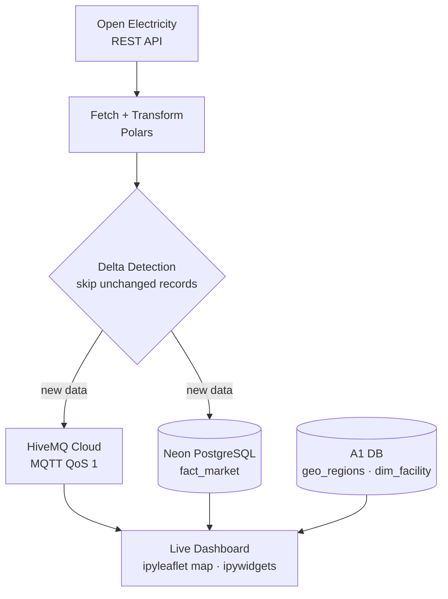

# Real-Time Energy Streaming Dashboard

> **Part 2 of the Australian Energy Data Platform** — the real-time layer.
> `[➊ Batch ETL](../energy-etl-pipeline)` → **Neon PostgreSQL + PostGIS** → `➋ Real-time streaming dashboard (this repo)`
>
> This dashboard consumes the `dim_facility` and `geo_regions` tables built by the batch ETL pipeline to geospatially enrich a live MQTT stream of NEM market data.

A live streaming pipeline and interactive dashboard that pulls Australian NEM (National Electricity Market) data from a REST API, publishes it over MQTT, stores it in a cloud database, and visualises it on an interactive map.

Solo project.

---

## What It Does

Every poll cycle, the pipeline fetches 5-minute operational data (power, emissions, market price, demand) from the Open Electricity API, cleans and aggregates it to facility grain, and publishes each facility's latest state to an MQTT broker. A background subscriber feeds a shared in-memory buffer, which a live `ipyleaflet` dashboard polls to refresh a map, table, and info panels in real time — without blocking the Jupyter kernel.

---

## Pipeline




---

## Architecture

The pipeline is split into four decoupled phases so ingestion, publishing, and visualisation never block each other:

1. **Data Retrieval** — pulls 5-minute operational time series from the Open Electricity API and joins static asset metadata + spatial footprints from the Neon PostgreSQL database (built by the A1 [energy-etl-pipeline](../energy-etl-pipeline)).
2. **Processing & Integration** — cleans the dataset and unifies it to a single facility-level grain.
3. **MQTT Publisher** — reads the cached dataset chronologically and streams discrete JSON payloads to a cloud HiveMQ broker to mimic live sensor feeds.
4. **Asynchronous Consumption & Visualisation** — an MQTT subscriber runs in a background thread and feeds an in-memory store that the dashboard polls in real time.

Stability is handled by `nest_asyncio.apply()` (prevents the Jupyter kernel from blocking the async `OEClient()` event loop) and credential protection via `python-dotenv` + a `.env` file.

System architecture — four decoupled phases from API retrieval to live dashboard

---

## Data Ingestion, Cleaning & Integration

**Acquisition under free-tier limits** — the API enforces payload thresholds that trigger request-timeout errors, so extraction processes facilities in **batches of 30**, pulling long-range history incrementally to bypass transmission constraints without data loss.

**Cleaning strategy** — four core anomalies are addressed before publishing:

- **Deduplication** — drops repeated rows from API batches on unique `(interval, facility_code)`
- **Anomaly rectification** — negative emission metrics clipped to `0`; out-of-scope timestamps and non-operational facilities filtered out
- **Missing-value imputation** — forward-fill followed by backward-fill to maintain continuous streams
- **Standardisation** — normalises text fields and casts types to match the A1 database schema

**Multi-unit aggregation** — a single physical facility often contains multiple generator units reporting separate series. Rows are grouped and aggregated by `time_interval_utc` + `facility_code`, then joined with regional market price and demand on `network_region`, so each MQTT payload is a clean single "state" of the whole facility per interval.

---

## MQTT Publishing

Records are streamed reliably from a background daemon thread while the notebook keeps executing:

- **QoS 1** — at-least-once delivery; a retry loop re-sends any failed message until the broker acknowledges it
- **Max inflight = 50** — at most 50 unacknowledged messages in flight; the publisher blocks for the oldest ACK before sending more, applying backpressure
- **Background thread** — `_publish_loop()` sorts by timestamp, groups records into 5-minute batches, publishes each, then drains pending messages and disconnects cleanly

MQTT publish flow — async thread, per-interval batching, and inflight-window backpressure

---

## MQTT Subscribing

The subscriber runs in the background via `loop_start()` and keeps the dashboard fed without freezing the kernel:

- `**on_connect()`** — connects to the broker and subscribes to the stream topic
- `**on_message()**` — unpacks each payload and writes it to the shared store as it arrives
- `**mqtt_data_lock**` — guards the shared buffer so reads and writes never collide, keeping state consistent under concurrent updates

MQTT subscribe flow — background loop with on_connect / on_message callbacks

---

## Interactive Dashboard

A vertical layout of four stacked layers, all refreshed by a background polling loop that detects new MQTT messages and updates only what changed.

**L1 · Header** — toggle circle-sizing between Power (MW) and Emissions (tCO2); dropdowns filter by region and fuel.

Header layer — circle-size toggles and region/fuel filters

**L2 · Map** — an interactive map with dynamic circle markers. Clicking a facility opens a "lazy" popup card that refreshes to the latest live values on open.

Map layer — dynamic circle markers across the NEMFacility popup card — latest live power, emissions, price, and demand

**L3 · Table** — real-time facility data in a scrollable table; clicking any column header sorts ascending/descending.

Table layer — sortable real-time facility metrics

**L4 · Info** — separates the *data record timestamp* from the *last refresh timestamp* to make late-arriving MQTT messages obvious.

Info layer — data-record vs last-refresh timestamps

**Performance & correctness** — optimised for 500+ facilities with batched marker creation and selective updates (only redraw when values change), a snapshot pattern behind `mqtt_data_lock` to avoid race conditions, and re-run-safe teardown (old poll timers stopped and observers re-bound before rebuilding the layout).

---

## Continuous Execution

Background publisher and subscriber threads keep the system running without stopping. Each round waits 60 seconds and **replays the cached dataset** instead of hitting the API again. From round 2 onwards a **delta-only** strategy republishes a record only if its values changed since the previous round — cutting redundant MQTT traffic while preserving time order. A live viewer reports the current round number and the number of facility records sent.

---

## Database Schema

`fact_market` uses a composite primary key `(time_interval_utc, facility_code)` and links back to the A1 database structure via `facility_code`:

```sql
CREATE TABLE fact_market (
    time_interval_utc   TIMESTAMP,
    facility_code       TEXT,
    power_mw            DOUBLE PRECISION,
    emissions_tco2      DOUBLE PRECISION,
    facility_name       TEXT,
    primary_fuel        TEXT,
    network_region      TEXT,
    lat                 DOUBLE PRECISION,
    lng                 DOUBLE PRECISION,
    market_price_mwh    DOUBLE PRECISION,
    market_demand_mw    DOUBLE PRECISION,
    PRIMARY KEY (time_interval_utc, facility_code)
);
```

---

## Tech Stack


| Category        | Tools                             |
| --------------- | --------------------------------- |
| Language        | Python 3.11+                      |
| Data processing | Polars                            |
| Async           | nest_asyncio                      |
| Messaging       | paho-mqtt, HiveMQ Cloud           |
| Database        | PostgreSQL (Neon cloud), psycopg2 |
| Dashboard       | ipyleaflet, ipywidgets            |
| API             | Open Electricity REST API         |
| Config          | python-dotenv                     |


---

## How to Run

```bash
pip install polars paho-mqtt psycopg2-binary ipyleaflet ipywidgets requests nest-asyncio python-dotenv
```

Create a `.env` file (see `.env.example`):

```
NEON_HOST=...
NEON_PORT=5432
NEON_DB=neondb
NEON_USER=...
NEON_PASSWORD=...
HIVEMQ_HOST=...
HIVEMQ_PORT=8883
HIVEMQ_USER=...
HIVEMQ_PASSWORD=...
OPENELECTRICITY_API_KEY=...
```

Run `energy-streaming-dashboard.ipynb`. The dashboard renders inline in Jupyter; the pipeline loop keeps polling until interrupted.

---

## Related — Part 1 of the Platform

This project is the real-time layer of a two-part data platform. The batch foundation, **[Australian Energy ETL Pipeline](../energy-etl-pipeline)**, ingests and geocodes multi-source government energy data into the `dim_facility` and `geo_regions` tables that this dashboard queries for map enrichment. Read that repo first to see how the serving layer is built; this repo shows how it's consumed in real time.